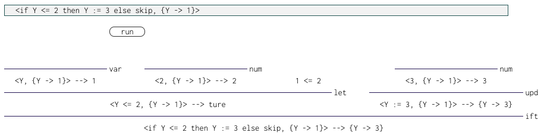

# Portfolio

## Works

- [

- Simple MOESI Protocol Emulator
](https://sano-jin.github.io/moesi/moesi.html)

- [IMP interpreter](https://sano-jin.github.io/moesi/moesi.html)
  - prints out the derivation tree for the input program
  

- [Lambda calculus interpreter](https://sano-jin.github.io/moesi/moesi.html)

- twitter[@sano65747676](https://twitter.com/sano65747676)
