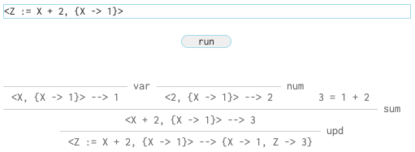
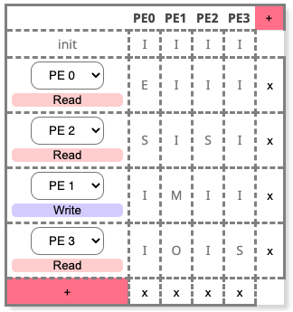

Hello from Tokyo, Japan. I'm Sano, a student at Waseda University majoring Computer Science. Welcome to my web portfolio!

# Works
Here are some of my works.

## IMP interpreter

IMP is a tiny imperative language specially designed for giving a formal description on execution of a program: Operational Semantics.
Input a program and press run to see the derivation tree (based on big-step semantics).
- [Try it on your browser](https://sano-jin.github.io/imp/imp.html)
- [Source code](https://github.com/sano-jin/imp-interpreter)

  
## Lambda calculus interpreter

Lambda calculus is an absolute foundation of Functional programming languages.
It is simple yet powerful enough to encode ALL the programs run on computers (as same as Turing Machine).
Input an expression and press run to get the full reduction graph.
- [Try it on your browser](https://sano-jin.github.io/lambda/lambda.html)
- [Source code](https://github.com/sano-jin/lambda)

## MOESI Protocol emulator

MOESI is a cache coherence protocol, implemented in ARM64.
Select Processing Elements (PE), set write/read option and observe their states to change. 
- [Try it on your browser](https://sano-jin.github.io/moesi/moesi.html)
- [Source code](https://github.com/sano-jin/moesi-emulator)

# Links
- [github](https://github.com/sano-jin)
- twitter[@sano65747676](https://twitter.com/sano65747676)
  - Please feel free to contact me.
